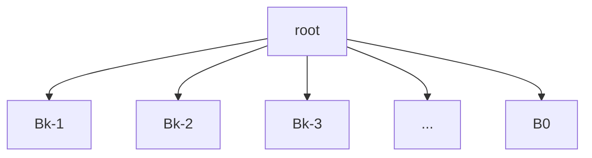

# 算法基础 10.13

#### 复杂度分析

时间、空间、通信

算法、问题

Worst, average, best, smooth

Worst case:
$$
max_{i \in U} T_A(I)
$$
Best case:
$$
min_{i \in U} T_A(I)
$$
Average case:
$$
\Sigma_IP(I)T_A(I)
$$
Tail-Analysis:
$$
PR(T_A(I) \le f(n)) \ge 1-\epsilon
$$
Meaning of Smooth:
$$
I \to T_A(I) \quad may\ be\ slow. \\
I' \to T_A(I') \quad may\ be\ quicker. \\
and\ the\ solution\ may\ similar.
$$
问题复杂性分析
$$
Sorting\ A_c(comparison\ based) \\
a_1,a_2,a_3...a_n \\
Consider\ a\ step:compare(a_i,a_j) \\
A\ sequence\ have\ N!\ possible solutions.
$$
考虑一个决策树，每个节点表示比较的两个对象，这棵树就代表了排序问题的问题复杂度。

那么这棵树的叶子结点数量至少为N!。

由于决策树是严格二叉的，故这棵树的深度H，即比较次数H（时间复杂度）要满足
$$
2^H \ge N!
$$
因此我们就得出结论，
$$
H\ge lg_2(N!) = \Sigma_{i=1}^Nlog_2i=\Theta(NlogN)\\
H=\Omega(NlogN)
$$

#### Sort in linear time

##### Counting sort

###### Assumption

input elements ranges [0...K], K is small.

###### Time complexity: O(n+k)

#### Radix Sorting

...

#### Bucket Sorting

Time Complexity: O(n)+O(logn/loglogn)

# 10.15

What CS cares about:

> * Computer.
>
> * Software: OS, PL, Compiler.
>
> * Methods: Algorithms.

Algorithms: Solving a problem with some resourse and condition.

An Problem: Prove that in the 2nd-chance method to handle the balls and bins problem, the most used box carries lglgn balls.

-------

从N个数的均匀分布序列中找到第K小的数的复杂度：

方法：猜答案是1/k。然后根据1/k的大小来递推。

# 10.20

Query median number in a sequence:

>* Randomized
>
>* Recursive: <- Determinisitic

Time complexity: O(n)

---

Sort, Select ---- Method of organizing data.

Data structure may influence the time complexity of algorithm.

Data structure:

> * in Hardware
> * in Algorithm

HeapSort: Heap is a data structure.(An extremely low-level heap)

Data Operations:

> * insert
> * delete
> * query
> * modify
> * maximum/minimum
> * statistics
> * predecessor/successor

An Example:

An takeaway food app:

> 1. Search and order.
>
> 2. Cook
> 3. Find a rider to deliver.*

##### Using an array to maintain some data to satisfy insert and delete method:

Idea: Hash algorithm.

H(x) = address of x.

insert: H(x) <- &x

Delete: release(&x), then H(x) <- NULL

Query: get the data in H(x)

----

##### Issue: Queries of membership.

Algorithm: Bloom Filter

> 1. Build a bool array F[] represent the appearence of i.
> 2. When a data inserted, give the data a Hash number H(x), which H(x) represents the address in F[].
> 3. x appears in X, when F[h[x]]=1

----

#### Heap

Maxheap: Root is the biggest the maximum. Father is bigger than it's children.

#### Binary Search Tree (Recursive definition):

> * An empty tree is a binary tree.
> * Left son is smaller than father, right son is bigger than father.
> * Each son is also a binary search tree.

To sort online: Do tree triversal

##### inorder triversal

##### Balance the Binary Search Tree:

> 1. Do nothing -> Worst case's posibility: 1/(n!) -> Randomize
> 2. RB-Tree -> Worst case: O(logn)

---

# 10.27

##### The height of an BST:

> * Worst case: n
> * Average case: logn Proof: Similar to QuickSort.(Using Decision Tree.)*
> * Best case: logn

**Proof Idea:** Suppose the new node devide the segment in to 2 parts with the lower segment's length over $\alpha n$.

So when we considering a random input flow, the division has an high propability that satisfy the idea.

----

Why using binary tree?

Advantages:

Disadvantages:  Accessing nodes may cause thrashing, due to the nodes are not continuelly stored in the base.

---

#### Heaps

A data  structure supports the following operations:

> 1. MakeHeap();
> 2. Insert();
> 3. Minimum or Maximum ();
> 4. Extract();
> 5. Union();

#### Binomial Tree

Recursive definition: B0 is a single node, Bk consists 2 binomial Bk-1

Binomial Heap is a sequence of binomial trees.

Storing N nodes needs log(N) binaomial trees.

**Maintain a Binomial tree needs to cosider to many condition, which increase the complexity**

#### Amortized Cost

Example: Heap with a bunch of operation. We care the total average time of each operation.

#### Potential Function

$H_i \to H_{i+1}$ Consentrate on the ith operation, define $\phi(H_i)$ is the total operation steps in operation 1 to i.

#### Fibonacci Heap

Defination: A set of min heaps.
$$
\tilde C_i=C_i+\Delta\phi(H) \\
\phi(H) = t(H)+2m(H) \\
Ci=Degree+Num\_of\_trees \le D_i+t(H)\\
\tilde C_i=C_i+\phi(H_i)-\phi(H_{i-1}), where\ \phi(H_i) \le D(n)+1+2m(H)-t(H)-2m(H)=D(n)-t(H)+1\\
\to \tilde C_i \le 2D(n)+1
$$
Delete min's time complexity: O(D(N))